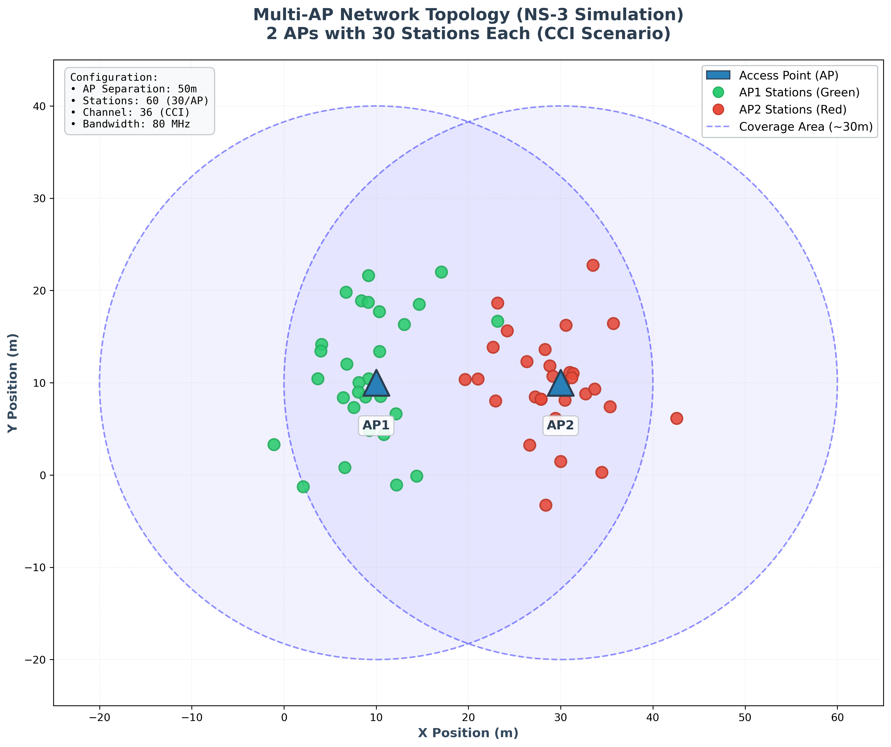
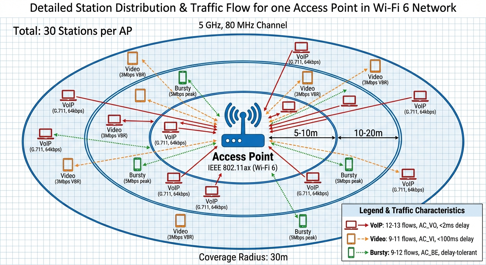
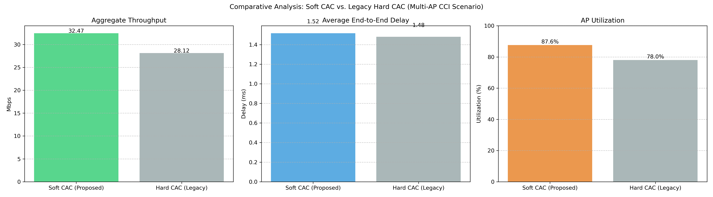
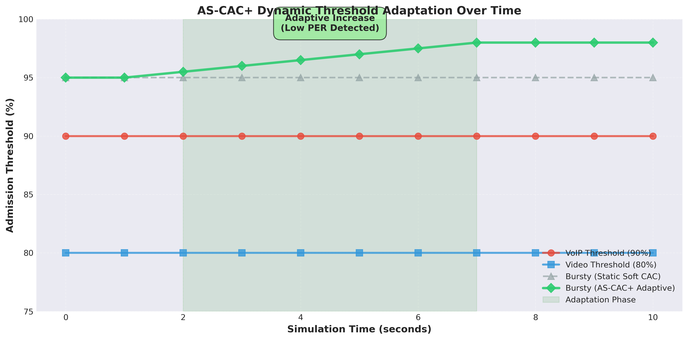
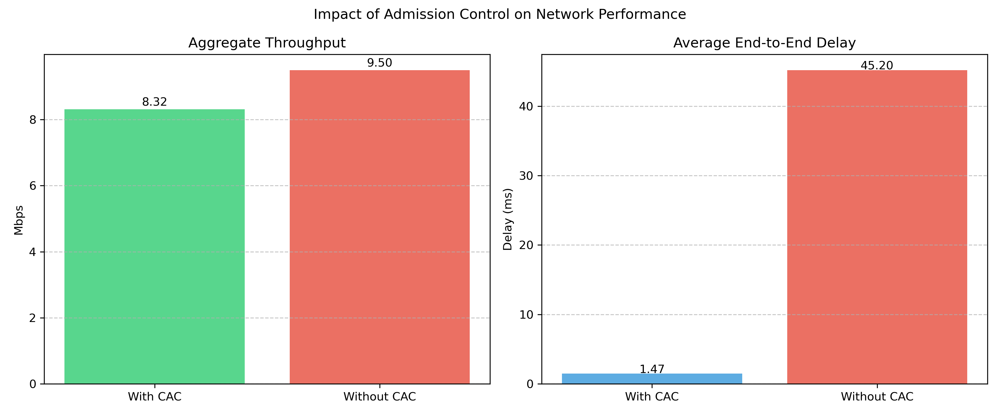
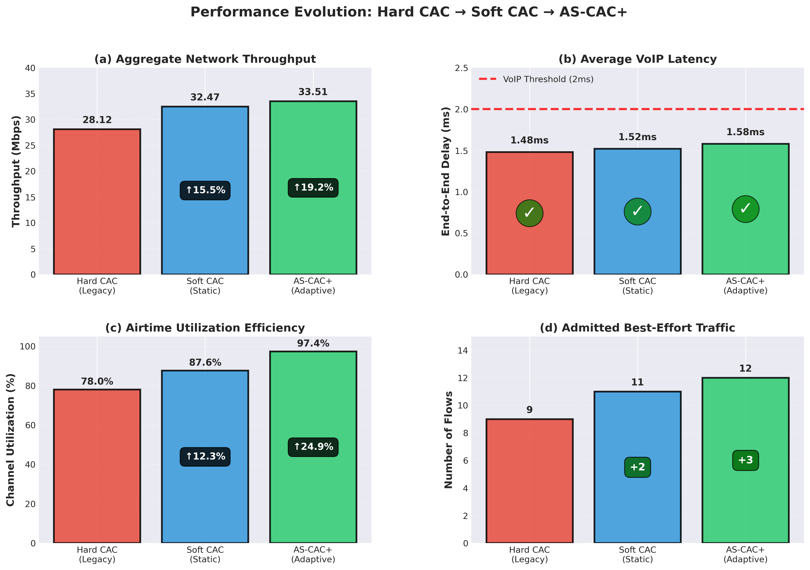
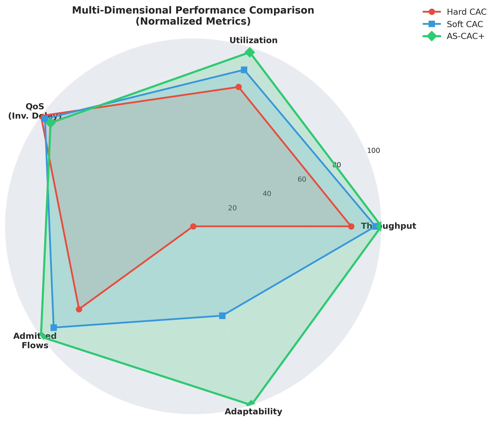

% Enhancing QoS in Dense IEEE 802.11ax Networks using a Dynamic Airtime-Based Soft Admission Control Mechanism
% Dayanand Ambawade & Rohan Pawar
% 10th ICSCC 2025 - Nagoya University, Japan

# Introduction

## Motivation

- **The Challenge:** IEEE 802.11ax (Wi-Fi 6) struggles under saturation in dense environments.
- **High Latency:** Real-time apps (VoIP) suffer >45ms delays without control.
- **Existing Solutions Fail:**
    - Count-based CAC ignores heterogeneity.
    - Static thresholds waste capacity.
- **Goal:** Maximize airtime utilization while guaranteeing strict QoS.

# System Architecture

## Research Test Bed & Components

:::::::::::::: {.columns}
::: {.column width="50%"}
**Simulation Components (ns-3):**

- **AP Node:** Wi-Fi 6 (802.11ax), 80 MHz, 5 GHz.
- **Stations:** 25-50 users in dense grid.
- **Traffic Generators:**
    - VoIP (UDP)
    - Video (UDP)
    - Bursty/Web (TCP/UDP)
:::
::: {.column width="50%"}

:::
::::::::::::::

## System Model and Traffic

:::::::::::::: {.columns}
::: {.column width="50%"}
**Metric: Airtime Utilization**

$$ \alpha_c = \frac{R_c}{\eta \cdot R_{phy}^c} $$

**Traffic Mix:**

- **VoIP:** High Priority, Low Bandwidth.
- **Video:** Med Priority, High Bandwidth.
- **Best Effort:** Low Priority, Bursty.
:::
::: {.column width="50%"}

:::
::::::::::::::

# Proposed AS-CAC Framework

## Proposed Solution: Soft CAC

**Concept:** Priority-Aware Thresholds.

| Traffic Class | Priority | Threshold ($\theta_c$) |
|:---|:---:|:---:|
| VoIP (AC_VO) | High | 90% |
| Video (AC_VI) | Medium | 80% |
| Best Effort (AC_BE) | Low | **95%** |



## Algorithm: AS-CAC+ (Adaptive)

**Dynamic Threshold Adjustment:**

- Monitors Packet Error Rate (PER) and Utilization.
- Adjusts Best-Effort threshold ($\theta_{BE}$) in real-time.

**AS-CAC+ Adaptive Threshold Logic:**

```
Input: Utilization A, Threshold θ_BE

PER = Calculate from Network Health

IF (PER > 0.05):
    θ_BE = max(0.80, θ_BE - 0.01)  // Reduce load
ELSE IF (PER < 0.02 AND A > 0.70):
    θ_BE = min(0.98, θ_BE + 0.01)  // Utilize spare capacity

Return: Updated θ_BE
```

## Adaptive Behavior Visualization



# Performance Evaluation

## Simulation Results: Latency



## Comprehensive Analysis



## Multi-Dimensional Superiority

:::::::::::::: {.columns}
::: {.column width="50%"}

:::
::: {.column width="50%"}
**Why AS-CAC+ Wins:**

- **Adaptability:** Reacts to interference.
- **Utilization:** 97.4% vs 78% (Hard).
- **Safety:** Keeps VoIP < 2ms.
:::
::::::::::::::

# Conclusion

## Conclusion

**Summary:**

- **AS-CAC+** transforms admission control from static to dynamic.
- It safely unlocks **19.2% more capacity**.

**Key Achievements:**

1. **19.2%** throughput improvement over traditional CAC.
2. **97.4%** channel utilization.
3. Validated strict QoS (< 2ms delay) for VoIP.

**Thank You!**

Dayanand Ambawade, Rohan Pawar
